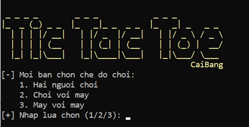
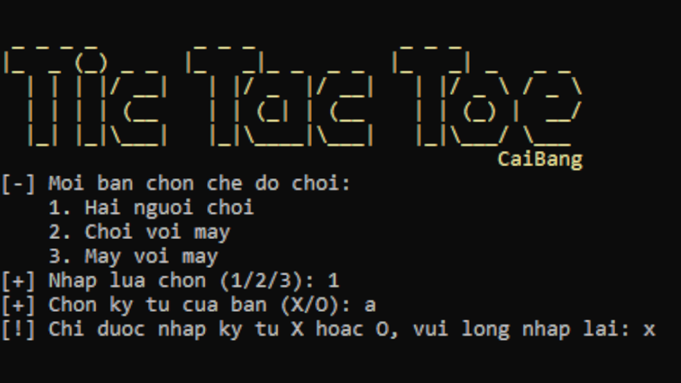
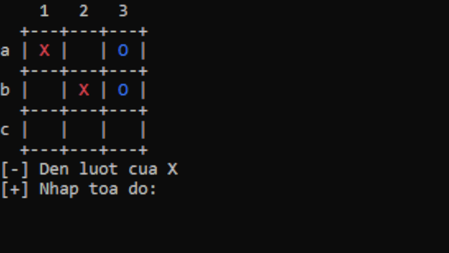
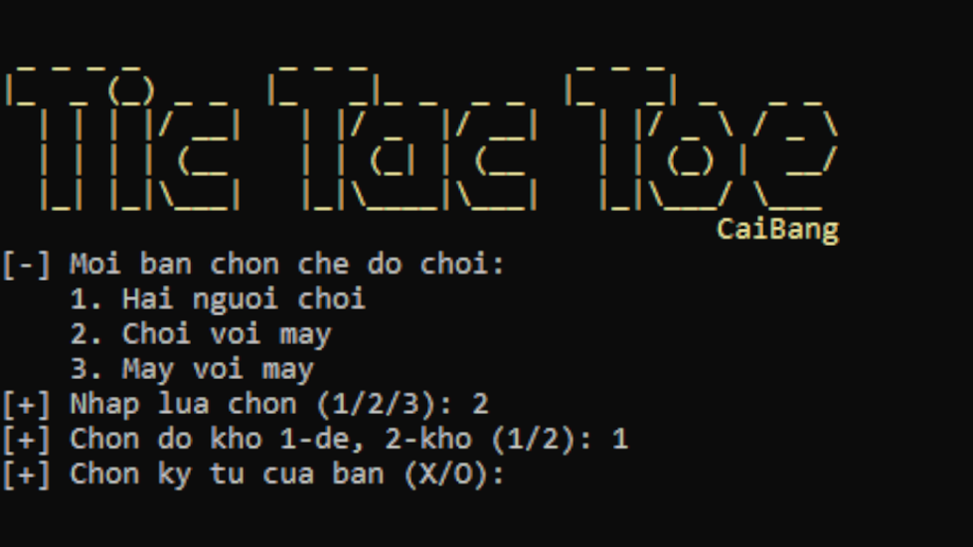
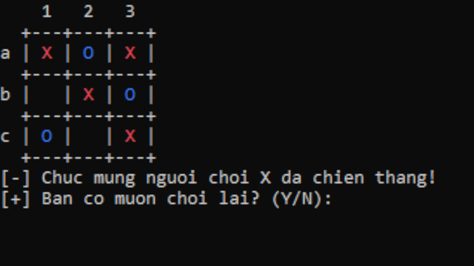

# 🧩 Tic-tac-toe Game Console

## 1. Giới thiệu 
**Tic-tac-toe** là một trong những trò chơi trí tuệ cổ điển, đơn giản dễ chơi, đã tồn tại và được ưa chuộng trong nhiều năm qua. Với tính linh hoạt, phù hợp với số đông, Tic-tac-toe không chỉ luôn được các bạn học sinh sinh viên yêu thích và ưu tiên lựa chọn khi tìm kiếm một trò chơi giải trí lúc giải lao, thư giãn sau những giờ học tập và làm việc căng thẳng, mà còn là một phương tiện thú vị để thể hiện sự cạnh tranh lành mạnh với nhau. Tính đơn giản, dễ hiểu và dễ chơi của Tic-tac-toe đã khiến nó trở thành một trong những trò chơi được yêu thích nhất và nó đã được chơi bởi hàng triệu người trên toàn thế giới.

Nhóm **Cái Bang** đã tạo ra một phiên bản Tic-tac-toe đơn giản trên giao diện dòng lệnh (CLI) bằng ngôn ngữ lập trình C++ và sử dụng các khái niệm lập trình hướng đối tượng bao gồm Object & Class, Inheritance, Abstract Class. Chương trình sẽ có đủ 3 chế độ chơi: người với người, người với máy và máy với máy, thay phiên nhau đánh trên một bảng 3×3. Nhóm đã nghiên cứu cài đặt được thuật toán tính toán nước đi đủ thử thách để người chơi cảm thấy thách thức hơn. Hứa hẹn chương trình sẽ mang lại trải nghiệm chơi game đầy thú vị, mượt mà và phong phú cho người chơi.

## 2. Hình ảnh minh hoạ
### 2.1. Giao diện chính

  
  

    

### 2.2. Nhập lựa chọn

  
  

    

### 2.3. Bàn cờ khi chơi

  
  

    

### 2.4. Chế độ chơi với máy

  
  

    

### 2.5. Chiến thắng

  
  

    